<!-- cairn-nav:start -->
<p align="center"><b>Cairn is a family of five repositories.</b> Each builds, tests and releases on its own; they agree through the shared <a href="https://github.com/ParkWardRR/cairn-driving-log-selfhosted/tree/main/contracts">contracts</a>.</p>

| Part | Repository | What it does | Stack | Docs | Issues | CI |
|---|---|---|---|---|---|---|
| Front door | [cairn-driving-log-selfhosted](https://github.com/ParkWardRR/cairn-driving-log-selfhosted) | Docs, roadmap, shared protocol contracts | Markdown · Go tools | [docs](https://github.com/ParkWardRR/cairn-driving-log-selfhosted/tree/main/docs) | [issues](https://github.com/ParkWardRR/cairn-driving-log-selfhosted/issues) | [CI](https://github.com/ParkWardRR/cairn-driving-log-selfhosted/actions) |
| Dongle | **[cairn-esp32-device-firmware](https://github.com/ParkWardRR/cairn-esp32-device-firmware)** ◀ you are here | In-car recorder: OBD-II, GNSS, IMU to encrypted SD bundles | C++ · C · Rust | [docs](https://github.com/ParkWardRR/cairn-esp32-device-firmware/tree/main/docs) | [issues](https://github.com/ParkWardRR/cairn-esp32-device-firmware/issues) | [CI](https://github.com/ParkWardRR/cairn-esp32-device-firmware/actions) |
| Phone | [cairn-ios-companion-app](https://github.com/ParkWardRR/cairn-ios-companion-app) | BLE relay, GPS assist, server client | Swift · SwiftUI | [docs](https://github.com/ParkWardRR/cairn-ios-companion-app/tree/main/docs) | [issues](https://github.com/ParkWardRR/cairn-ios-companion-app/issues) | [CI](https://github.com/ParkWardRR/cairn-ios-companion-app/actions) |
| Server | [cairn-vehicle-server](https://github.com/ParkWardRR/cairn-vehicle-server) | Verifies, decrypts, stores; serves app and dashboard | Go | [docs](https://github.com/ParkWardRR/cairn-vehicle-server/tree/main/docs) | [issues](https://github.com/ParkWardRR/cairn-vehicle-server/issues) | [CI](https://github.com/ParkWardRR/cairn-vehicle-server/actions) |
| Dashboard | [cairn-vehicle-web-dashboard](https://github.com/ParkWardRR/cairn-vehicle-web-dashboard) | Browser UI: trips, places, engine, health | Nuxt · TypeScript | [docs](https://github.com/ParkWardRR/cairn-vehicle-web-dashboard/tree/main/docs) | [issues](https://github.com/ParkWardRR/cairn-vehicle-web-dashboard/issues) | [CI](https://github.com/ParkWardRR/cairn-vehicle-web-dashboard/actions) |

<sub>Shared: [Roadmap](https://github.com/ParkWardRR/cairn-driving-log-selfhosted/blob/main/ROADMAP.md) · [Install](https://github.com/ParkWardRR/cairn-driving-log-selfhosted/blob/main/INSTALL.md) · [Architecture](https://github.com/ParkWardRR/cairn-driving-log-selfhosted/blob/main/docs/architecture.md) · [Threat model](https://github.com/ParkWardRR/cairn-driving-log-selfhosted/blob/main/docs/threat-model.md) · [Trust model](https://github.com/ParkWardRR/cairn-driving-log-selfhosted/blob/main/docs/trust-model-v3.md) · [Contracts](https://github.com/ParkWardRR/cairn-driving-log-selfhosted/tree/main/contracts) · [Archive of the original monorepo](https://github.com/ParkWardRR/cairn-original-monorepo-archive)</sub>
<!-- cairn-nav:end -->

# Cairn ESP32 device firmware

**The firmware for the Cairn in-car dongle: it records your drives to an SD card as encrypted, tamper-evident bundles, and hands them to your phone over Bluetooth. It never deletes a trip until your own server has signed for it.**

[](https://github.com/ParkWardRR/cairn-esp32-device-firmware/actions/workflows/ci.yml)
[](https://github.com/ParkWardRR/cairn-esp32-device-firmware/actions/workflows/interop.yml)
[](LICENSE)

This repository is one of five that make up [Cairn](https://github.com/ParkWardRR/cairn-driving-log-selfhosted), a self-hosted car driving log. This one is the dongle. The system is:

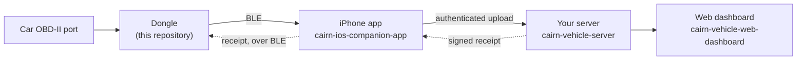

Contents: [What it is](#what-the-dongle-is-and-is-not) | [Status](#status) | [Hardware](#hardware) | [Architecture](#architecture) | [Capture to bundle](#from-capture-to-a-sealed-bundle) | [BLE and offload](#ble-service-and-bundle-offload) | [Enrolment](#enrolment-and-provisioning) | [secrets.h](#secretsh) | [OTA and partitions](#ota-and-the-ab-partitions) | [Security](#security-posture) | [Engine profiles](#engine-profiles) | [Device info and boot timing](#device-info-and-boot-timing) | [Cores not yet wired](#host-tested-cores-that-are-not-wired-in-yet) | [Tests](#tests) | [Layout](#repository-layout) | [Build and flash](#build-flash-and-test) | [Configuration](#configuration) | [Troubleshooting](#troubleshooting) | [FAQ](#faq) | [Docs index](#docs-index) | [Contributing](#contributing) | [License](#license)

## What the dongle is, and is not

**Is.** A Freematics ONE+ Model B (ESP32) plugged into the car's OBD-II port. While you drive it samples the engine computer (OBD-II PIDs), GNSS position and an accelerometer/gyro, decides when a trip starts and ends, and writes everything to a microSD card in a format designed to survive power loss and tampering. When you park, it seals the trip into a signed bundle and waits for your phone to collect it.

**Is not.**

- **Not a network device in the shipped firmware.** This code has no Wi-Fi, no LTE and holds no network credentials of any kind: no SSID, password, client certificate or transport private key. Bundles leave the dongle one way, over BLE to the enrolled phone. (The owner has decided the dongle regains Wi-Fi and LTE. The scheduling, configuration, digest and data-accounting logic for that exists and is host-tested, but no radio transport or credential store does, so nothing of it runs on the device. See [Status](#status).)
- **Not trusted to delete on anyone's say-so.** Not even the phone's. A bundle is deleted only when a receipt signed by your server, verified on the dongle against a key pinned in the firmware, names that exact bundle.
- **Not a place where the card is the security boundary.** Every record on the SD card is encrypted. Pulling the card reveals ciphertext.
- **Not chatty on the car's network.** While the car is parked the dongle sends no diagnostic requests at all (the "parked-silence" rule, [below](#power-and-parked-silence)).
- **Not a bootloader-secured device.** This unit's chip cannot do ESP32 Secure Boot V2; see [Security posture](#security-posture).

The phone sees only ciphertext and is trusted for availability, not for secrecy or deletion; the server holds the keys to read the data.

## Status

Separating what is proven from what is only designed. "Hardware" means run on the one real dongle (ESP32 revision v1.0). Dates are from the docs in `docs/`; the front door's [ROADMAP](https://github.com/ParkWardRR/cairn-driving-log-selfhosted/blob/main/ROADMAP.md) is the newer record.

| Area | State |
|---|---|
| Capture (OBD, GNSS, IMU), trip detection, pre-roll, sealing, storage self-checks | Shipped. Capture, seal and storage checks passed on the real dongle (2026-10-05, `docs/hardware-roundtrip.md`); a real drive informed the sampling constants |
| Bundle format v3 (AEAD frames, hash chain, signed manifest) | Shipped. Byte-exact with the Go reference and the independent Rust implementation on the pinned vectors (host) |
| Crash recovery (torn tails, interrupted seals and prunes) | Host-tested with fault injection; also exercised by pulling power on the bench |
| BLE service: phone GNSS in, quality and status out | Shipped in every build |
| BLE bundle offload and the receipt-verified prune | Implemented. Host-tested end to end with the real phone client and the real server relay over a simulated link. **Not yet run over the air** as of `docs/hardware-roundtrip.md` (2026-10-05) |
| Enrolment and USB provisioning | Shipped, exercised on hardware; the enrolment blob is byte-identical to the Go reference on shared vectors |
| A/B partition table, rollback marking | Table present; the image marks itself valid only after the card checks out |
| OTA: update gate (signed descriptor, version order, preconditions) | Host-tested pieces only. **No code fetches or installs an image yet**; delivery is planned over BLE |
| Flash encryption, NVS encryption, Secure Boot | **Not enabled**, and Secure Boot V2 is not available on this chip. A plan, not a feature |
| Standby (parked low power) | Implemented; the current draw has **not been measured** |
| Engine profiles (`engines/`, `tools/enginegen`, `lib/cairn_engine`) | **Wired in.** The OBD request, value conversion, cadence, engine-on voltage and standby and drive-confirmation dwells come from the active profile. The BMW N20 profile is `derived` and proven equal to the previously hard-coded values; the B58 profile is a `stub` (identity only). The schema and formula language are a **draft** |
| Device information over BLE (`DEVICE_INFO`, characteristic `0040`) | **Wired in** and host-tested against the contract's vectors (contracts-v0.2.0, draft). Not yet read by a phone from a real unit |
| Boot timing record | **Wired in** (marks in `setup()` and the lifecycle, logged on the console and SD log, carried in device info). **Not measured** on the unit: no numbers and no budget exist |
| Signed check-in instructions and the home trigger (`lib/cairn_checkin`) | **Host-tested only.** Needs a pinned instruction key that is not in `secrets.h` yet, and its GATT characteristics are not created |
| Configuration receiver (`lib/cairn_config`) | **Host-tested only, provisional.** The config contract is unreleased; credentials are refused until storage is encrypted |
| Uplink manager (`lib/cairn_uplink`) | **Host-tested only.** There is no Wi-Fi or LTE transport for it to schedule |
| LTE digest and data accounting (`lib/cairn_digest`, `lib/cairn_usage`) | **Host-tested only, provisional.** Draft wire format, no contract vectors, nothing sealed or sent |
| Wi-Fi and LTE transports, credential storage | **Not implemented.** Planned by the owner; gated on flash and NVS encryption |

## Hardware

Freematics ONE+ Model B. Values below are the ones measured on the real unit (`docs/flashing-and-testing.md`) or set in the code.

| Part | What it is here |
|---|---|
| MCU | Classic ESP32-D0WDQ6, **revision v1.0**, dual core, 160 MHz as configured; 16 MB flash (W25Q128, DIO mode); PSRAM (see the [FAQ](#faq)) |
| OBD-II | An STM32 co-processor (ELM327-compatible, device type 15) on UART2 (RX 13, TX 14, 115200). It does the CAN work; the ESP32 asks it for PIDs. Round trips measured at 110 to 140 ms per request, so about eight PIDs per second at best |
| GNSS | Internal receiver, reached over the co-processor link (38400 baud soft serial, power pin 12). The external GNSS path fails on this unit and the internal one succeeds; both paths verify that NMEA actually arrives |
| IMU | ICM-42627 over I2C at 0x68. The vendored driver left its self-test bit on; that is fixed in `third_party/` (details in `docs/flashing-and-testing.md`) |
| Storage | microSD over SPI, chip select GPIO 5; the only bus this code drives itself. The slot has been seen to fail to mount intermittently, so mounting retries at boot and again from the main loop |
| BLE | The ESP32's own radio, using NimBLE. The dongle is the BLE peripheral; the phone is the central |
| Other | Status LED on GPIO 4 (lit while faulted). No cellular modem is powered or used by this firmware; whether this unit carries one is unconfirmed |

The OBD connector's supply rail is read locally (it puts nothing on the car's bus); engine-on is taken to be above 13.2 V.

## Architecture

`src/` is Arduino C++ and runs only on the device. `lib/` is portable C compiled both for the ESP32 and, natively, by the host tests, so the code that matters most is the code that is tested. A few modules in `lib/` are built and host-tested but not yet called from `src/`; they are marked below.

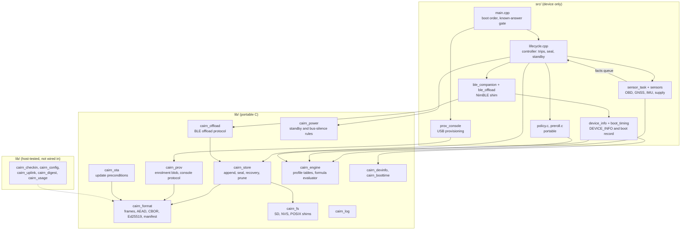

How it runs:

- **One controller owns all state.** The sensing task (its own task, on the core the controller does not use) only reports "facts" into a bounded queue; it never touches the card. The controller drains the queue, owns every lifecycle transition and is the only writer of frames. Overflow is counted and reported in the data (`DEVICE_HEALTH`), not hidden.
- **Four independent regions** (capture, bundle, link, health), each with its own evidence. Every transition is recorded in the journal chain with the policy version in force, so a decision can be explained from the data alone. Health is a bitmap, not a severity: degradation is recorded, never a reason to stop capturing.
- **Boot order** is deliberate: logging first (RAM-buffered until the card mounts), then the card, then finish interrupted seals, then interrupted prunes, then open or resume the capture. A format self-check (CRC-32 and SHA-256 known answers) must pass before capture; if the primitives in a build are wrong, the device refuses to write data the verifier would reject.

```mermaid
flowchart LR
    a["Log init and USB console"] --> b["Mount SD<br/>(retry, also from loop)"]
    b --> c["Create /cairn tree, attach SD log"]
    c --> d["Format known-answer check"]
    d --> e["Mark OTA image valid<br/>(if pending)"]
    e --> f["Load identity and storage root"]
    f --> g["Finish interrupted seals,<br/>then interrupted prunes"]
    g --> h["Open or resume capture"]
    h --> i["Start sensing task, then BLE"]
```

### Capture lifecycle

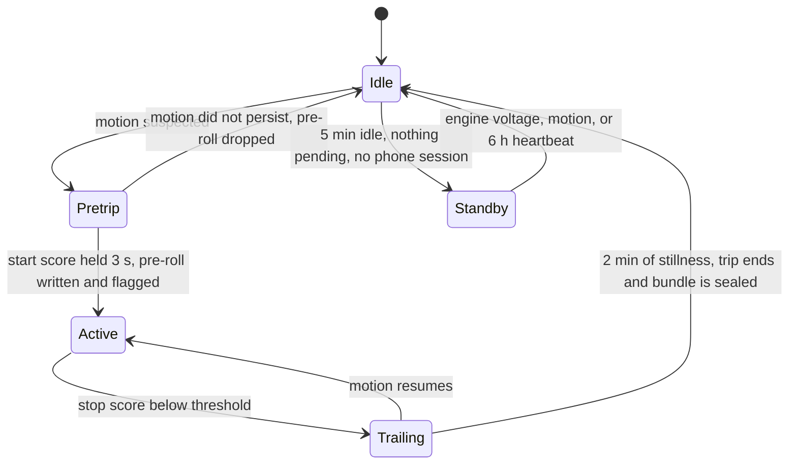

Thresholds (policy version 1, `include/config.h`; the values are also written into every bundle): start score 1.50 with a 3 s dwell, stop score 0.40 with a 2 minute dwell, and a 45 s pre-roll ring (128 slots) so the start of a drive is not lost to the dwell. Sampling is event-adaptive: the nominal periods (GNSS 200 ms, IMU window 100 ms, OBD batch 200 ms, full OBD sweep 1.2 s, health every 30 s) are upper bounds, so adaptation only ever adds detail.

### Power and parked silence

On a BMW F3x the OBD connector carries only D-CAN, gated by the body domain controller, so any request while parked wakes the gateway and the car's energy management can count it. The firmware therefore enforces a named invariant, tested on the host: **no diagnostic request is transmitted unless a drive is confirmed**, and drive confirmation uses only bus-silent evidence (the supply rail lifting above engine-on, or sustained accelerometer motion, each with a dwell; both together are accepted quickly). A periodic health wake never opens the bus.

Standby is not deep sleep: the ONE+ does not route the IMU interrupt to an RTC-capable pin, and timer-wake deep sleep would re-run the card recovery scan on every wake. Instead the radio and GNSS go off, the co-processor enters low power, the CPU drops to 80 MHz and the core light-sleeps between one-second polls. Standby is refused while a trip is open, while the capture is unsealed, or while sealed bundles are pending and a phone is connected. The draw is unmeasured.

## From capture to a sealed bundle

Everything on the card is bundle format v3, specified (with vectors) in the [contracts](https://github.com/ParkWardRR/cairn-driving-log-selfhosted/tree/main/contracts/format/v3). In outline:

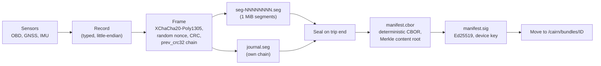

- **Records** emitted by this firmware: `GNSS_SAMPLE`, `IMU_SUMMARY`, `OBD_SNAPSHOT`, `OBD_EXTENDED`, `GNSS_GAP`, `TRIP_EVENT`, `POLICY_SNAPSHOT`, `STATE_TRANSITION` and `DEVICE_HEALTH`. `IMU_RAW_WINDOW` is defined by the format but not emitted. Phone-sourced GNSS fixes are stored with a source flag so they are never mistaken for the receiver's own.
- **Frames.** Each frame is a 24-byte header, a 24-byte random nonce, the encrypted payload, a 16-byte Poly1305 tag and a CRC-32 trailer (68 bytes of overhead, 4096 bytes at most). The segment header and frame header are authenticated data, so a frame cannot be moved between segments or edited. Each frame cites the CRC of the previous one, forming a chain; a gap, splice or reorder is detectable.
- **Keys.** A random 32-byte root key (`K_root`) lives in NVS. Each segment's key is `HKDF-SHA256(K_root, salt = vehicle_id, info = "cairn/segment/v3" plus the device, assignment, boot and segment ids)`. The server holds an escrowed copy of the root (see enrolment); the phone never does.
- **Recovery needs no key.** The boot scan is structural: it checks CRCs and the chain, truncates a torn tail to the last valid frame and records the exact discarded byte count in the manifest, so a bundle reports being short instead of looking complete. A device that has lost its key still seals what is on the card.
- **Durability.** Flush every 32 frames or 5 s. The device counter that defends against rollback is reserved durably before the first segment header names it and committed again before the manifest is signed, so a power cut cannot hand one counter to two different bundles; a reserved but never-sealed counter is a hole the server reports, the harmless direction.
- **Seal** hashes the members, builds and signs the manifest (written before the directory is moved, so an interrupted seal is always completable without re-signing), then moves `capture/<id>` to `bundles/<id>`. A sealed bundle is never modified.
- **Identity.** A bundle's operational handle is a ULID directory name; its real identity is the content root. Ordering truth is `(boot_id, seq)`, never wall-clock UTC, which is recorded only as an annotation with its own accuracy.
- **Limits.** At most 16 members and 64 chunks per bundle; if the budget is exhausted the controller seals at the next opportunity rather than fabricate continuity.

The card layout:

```text
/cairn/capture/<ULID>/      the one open, unsealed bundle
/cairn/bundles/<ULID>/      sealed, awaiting a receipt:
    seg-00000000.seg ...    capture frames (one chain across segments)
    journal.seg             transitions and health (own chain)
    manifest.cbor           the exact bytes that were signed
    manifest.sig            64-byte Ed25519 signature
/cairn/receipts/<ULID>.cbor verified receipts
/cairn/state/               prune intent journal
/cairn/logs/                verbose boot logs (capped, yields to capture)
```

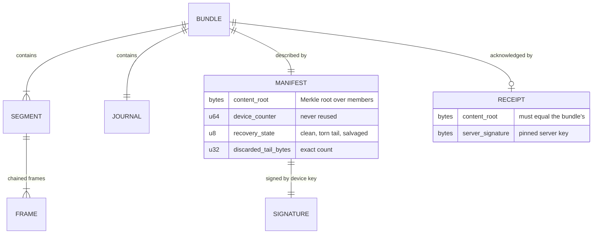

Logs: one file per boot under `/cairn/logs`, monotonic timestamps (never UTC), and an 8-hex boot-id prefix tying lines to bundles. Below 64 MiB free the SD log sink switches itself off and logging continues over UART only; the log tree is capped at 16 MiB, oldest first. A debugging aid must not cost a trip.

## BLE service and bundle offload

The dongle advertises as `Cairn` with the service UUID `A8E30000-4F5B-11EF-A017-325096B39F47`. The wire formats are the [BLE protocol v1 contracts](https://github.com/ParkWardRR/cairn-driving-log-selfhosted/tree/main/contracts/ble/v1) (`spec.md` and `offload.md`); this firmware implements:

| Characteristic | Suffix | Direction | Purpose |
|---|---|---|---|
| `PROTOCOL_VERSION` | `00F0` | read | `{version 1, capabilities}`; bit 0 phone GNSS, bit 2 offload (only if the offload task actually started), bit 3 device information |
| `GNSS_FIX` | `0001` | phone to dongle, write without response | 28-byte phone location, used when the receiver has no fix |
| `GNSS_QUALITY` | `0010` | notify | receiver fix type, satellites, HDOP, fix age |
| `COMPANION_STATUS` | `0011` | notify | accepted, rejected and dropped fix counters |
| `DEVICE_INFO` | `0040` | read | firmware, identity, storage, transport, installed engines and boot timing, as a versioned record list (see [below](#device-info-and-boot-timing)) |
| `OFFLOAD_CONTROL` | `0030` | write and indicate | offload requests and responses |
| `OFFLOAD_DATA` | `0031` | notify and write without response | bundle bytes out, receipt bytes in |

The Phase 2 characteristics of the contract (`BARO_ALT`, `UTC_SYNC`, `OBD_LIVE`, `DEVICE_STATUS`) and the check-in characteristics `0041` to `0044` are not created, and their capability bits stay clear: a bit for something absent would be a lie the app is told to trust.

**Pairing and access.** LE Secure Connections with bonding and man-in-the-middle protection; the dongle is display-only and uses a static six-digit passkey from `secrets.h`. Every characteristic requires an encrypted, authenticated link, so an unbonded phone can discover the dongle but read, write or subscribe to nothing. One bond is kept (`CONFIG_BT_NIMBLE_MAX_BONDS=1`); a new bond replaces the old. A phone fix is accepted only if it is under 3 s old, flagged position-valid and not a repeated sequence number.

### Offload and the receipt-verified prune

The offload module (`lib/cairn_offload`) is plain C with no BLE dependency, so the framing, the refusals and above all the receipt gate run on the host against exactly the code the device runs. A thin NimBLE shim copies bytes into a queue and a dedicated task runs the module (NimBLE's own task stack is too small for Ed25519 and card reads).

Rules of the protocol:

- Operations: `LIST`, `GET_MANIFEST`, `READ`, `PUT_RECEIPT`, `ABORT`. One at a time; a second request gets `BUSY`.
- **Refused while a trip is in progress** (`TRIP_ACTIVE`): any capture state other than idle. Offload competes with capture for the card, and capture is never degraded to serve a transfer. If the controller cannot tell, the answer is "active". A bundle only exists to offload once sealed, a couple of minutes after you stop.
- Needs an MTU large enough for one list entry (payload of at least 40 bytes), else every request answers `IO_ERROR`. The firmware sets its own MTU to 185.
- Transfers end with a done indication carrying the byte count and an IEEE CRC-32; the phone re-reads a range if either is wrong. An operation that makes no progress for 8 s is abandoned. A disconnect abandons everything and scrubs the receipt buffer.
- An active offload keeps the dongle out of standby, bounded (120 s inactivity window, 15 minute cap per connection) so a phone that stays connected cannot keep it awake forever.

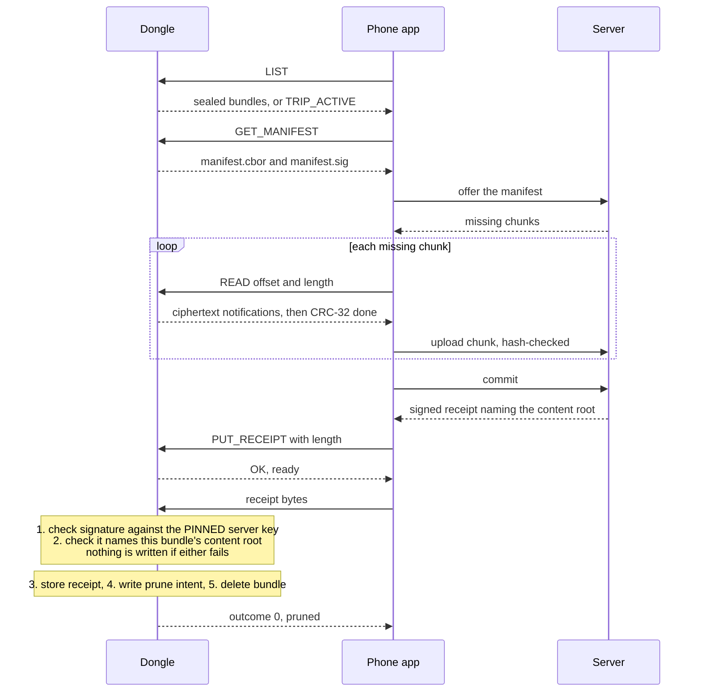

**The gate.** `cairn_receipt_check` verifies a receipt before anything touches the card, so a forged receipt cannot overwrite a genuine stored one. A prune requires both a valid signature under the key pinned in `secrets.h` and a matching content root. The prune writes an intent record first, so a power cut mid-delete is recognised and finished at the next boot. If the key is the all-zero placeholder the dongle hands over bundles but never prunes: a full card loses nothing, a wrongly authorised prune loses a trip permanently.

| Outcome | Meaning |
|---:|---|
| 0 | Verified and pruned |
| 1 | Verified and stored; the delete did not finish (completed at boot) |
| 2 | Rejected: malformed, or the signature does not verify (server and pinned key disagree) |
| 3 | Rejected: genuine receipt for different content |
| 4 | No key pinned in this firmware; nothing stored or deleted |

A failed upload (out-of-sequence frame, too many bytes, stall, trip start) ends with the `0x84` indication, a non-zero status and no outcome byte; nothing is stored or deleted.

## Enrolment and provisioning

The dongle generates its own Ed25519 identity on first boot, so it cannot be enrolled in advance: the server must be told a public key that does not exist until the hardware has run once. Everything happens over the USB console. The wire format is the [enrolment v1 contract](https://github.com/ParkWardRR/cairn-driving-log-selfhosted/tree/main/contracts/enrolment/v1); the operator procedure is `docs/device-provisioning.md` in [cairn-vehicle-server](https://github.com/ParkWardRR/cairn-vehicle-server).

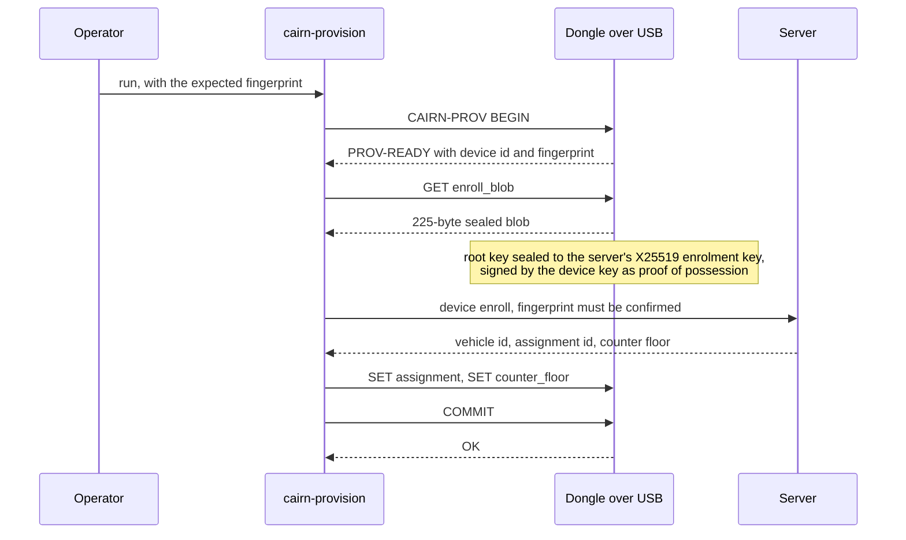

Rules the firmware enforces (and the host tests attack):

- **Never during a trip.** An unassigned dongle accepts a session at any time; an assigned one only in the first 60 s after boot, so an unattended unit cannot be reprovisioned by someone who plugs in later. A session idles out after 30 s and its staged values are scrubbed.
- **No secret is echoed or logged.** A host test sends a canary through every path and asserts it appears in no reply and no log line.
- **All-or-nothing commit.** The assignment and the counter floor are idempotent, and the floor only ever rises (lowering a counter is exactly the rollback the counter exists to defeat), so a failed `COMMIT` is safe to send again.
- **It refuses to seal to a key nobody holds.** With the all-zero placeholder enrolment key in `secrets.h` the dongle produces no blob.
- **No network credentials exist to provision.** `SET wifi_ssid` and its relatives are answered `unknown field`. At boot the firmware also erases Wi-Fi and client-certificate material left by older firmware and zeroes every deleted NVS entry in place on each boot, so deleted credentials do not stay readable in flash (an earlier page-recycling scrub was best effort and missed the Wi-Fi stack's saved password). The live entries, the device identity among them, remain readable over USB: only flash encryption makes the chip itself safe.

An unassigned dongle still captures and seals ("data first"), but the server refuses such bundles until an assignment exists. Physical access to the USB cable remains the trust boundary until flash encryption is on; the rules narrow what a person with a cable can do, they do not remove it.

## secrets.h

`include/secrets.h` holds three build-time values. It is gitignored; the template is `include/secrets.h.example`, which holds placeholders only:

```c
// include/secrets.h  (never commit; copy from secrets.h.example)
#define CAIRN_SERVER_ENROLL_PUBKEY_HEX "<64 hex chars: server X25519 enrolment public key>"
#define CAIRN_SERVER_RECEIPT_KEY_HEX   "<64 hex chars: server Ed25519 receipt-signing public key>"
#define CAIRN_BLE_PASSKEY              <six digits you choose>
// optional: pin an update key to switch the OTA gate on
// #define CAIRN_UPDATE_KEY_HEX        "<64 hex chars: Ed25519 update public key>"
```

| Value | Where it comes from | If left as the placeholder |
|---|---|---|
| `CAIRN_SERVER_ENROLL_PUBKEY_HEX` | `cairn-server -print-enroll-key` | the dongle refuses to emit an enrolment blob |
| `CAIRN_SERVER_RECEIPT_KEY_HEX` | `cairn-server -print-receipt-key` | bundles are handed off but **never pruned**; the card fills rather than losing a trip |
| `CAIRN_BLE_PASSKEY` | you choose | the template value is public, so pick your own; the BLE build stops with an error if no passkey is defined |
| `CAIRN_UPDATE_KEY_HEX` | `cairn-signfw -genkey`, then `-print-public` | OTA stays off (undefined means off) |

All of these are public keys or a pairing passkey; none is a signing key. The receipt key is pinned on purpose: receipts are verified against it, never against a key supplied in a response, because a receipt is what authorises a deletion. Without a `secrets.h` the project still builds (config falls back to placeholders) but cannot enrol or prune, so check the boot log after flashing instead of assuming.

## OTA and the A/B partitions

`partitions-ab.csv` lays out two application slots from the first flashing, because retrofitting OTA onto a device wired into a car means pulling it out; the slots cost nothing, their absence is unrecoverable.

| Partition | Offset | Size | Holds |
|---|---|---|---|
| `nvs` | `0x009000` | 20 KB | boot count, policy and counters, device key, storage root |
| `otadata` | `0x00e000` | 8 KB | which slot is active and its rollback state |
| `app0` | `0x010000` | 1.69 MB | OTA slot A |
| `app1` | `0x1c0000` | 1.69 MB | OTA slot B |
| `nvs_keys` | `0x370000` | 4 KB | reserved for NVS encryption keys (flash encryption is not enabled) |
| `errlog` | `0x371000` | 64 KB | error and reboot-cause journal |
| `coredump` | `0x381000` | 64 KB | panic dumps, so a parked-car crash is diagnosable |

The table fits in the first 4 MB; the chip has 16 MB, so about 12 MB is deliberately unused (changing the configured flash size alters the bootloader header, a boot-loop class of risk, for no benefit today).

**What exists.** After the card mounts and the format check passes, an image that booted from a fresh OTA slot marks itself valid (`esp_ota_mark_app_valid_cancel_rollback`); otherwise the bootloader rolls back at the next reset, and the boot log says when that happened. The update gate in `lib/cairn_ota` and `lib/cairn_format` is host-tested: a signed update descriptor (version, image SHA-256, length, minimum version) verified against a pinned **update key that is separate from the receipt key**, strict version ordering (an unparseable version is refused, never guessed), and four preconditions: no unreceipted bundles, parked, healthy supply, update key pinned.

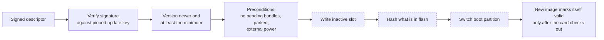

The dashed steps do not exist yet. Nothing fetches an image, writes the inactive slot, reads it back to hash it, or sets the boot partition. `docs/ota.md` documents the intended ordering (verify the descriptor first, write the inactive slot, hash what is actually in flash, switch last) and still shows the retired HTTP endpoints; delivery is planned over BLE. Pinning an update key only enables the gate.

## Security posture

The full plan, with the irreversibility table and a verification checklist, is [docs/esp32-hardening.md](docs/esp32-hardening.md). The short version:

**The chip.** Measured on the real unit: ESP32-D0WDQ6, **revision v1.0**, the oldest silicon. **Secure Boot V2 needs revision v3.0 or later and is not available on this unit.** Only the weaker V1 scheme is possible, with its own limits (bootloader size and layout, a one-time key burn). Flash encryption is available on every revision, but on v1.0 the number of plaintext re-flashes in development mode is a tightly limited counter. The unit currently has neither enabled (flash encryption counter 0, secure boot off, JTAG and UART download left available). Enabling any of it is irreversible and is not planned on the only unit in the car. The plan is to prove signed OTA first, move to an ESP-IDF configuration (`sdkconfig.defaults`) so these options can be set at all, rehearse on a spare unit, and consider a newer ONE+ for the car.

**What applies instead, today.**

| Layer | What protects what |
|---|---|
| SD card | Application-layer encryption (XChaCha20-Poly1305 per frame, HKDF-derived per-segment keys); the card is never the security boundary |
| Integrity | Frame CRC and hash chain, signed manifest (Ed25519, device key), Merkle content root, monotonic device counter against rollback and cloning |
| Deletion | Receipt gate: pinned server key, matching content root, intent journal |
| Network | No Wi-Fi, no LTE and no network credentials in this firmware; legacy credentials are erased at boot |
| Radio | BLE bonding with MITM-protected Secure Connections and a passkey; encrypted and authenticated characteristics; the phone carries ciphertext only |
| Console | USB provisioning never during a trip, 60 s window when assigned, no secret echoed or logged |
| Updates (design, host-tested gate) | Separate update key; signature before download; hash read back from flash; boot partition switched last; rollback on a failed self-check |
| Stolen, running dongle | Not solved by hardware. Handled by revocation on the server and a short exposure window |

**Known limits, stated plainly.** Without flash encryption the device signing seed and `K_root` are readable from an extracted chip (the seed authorises uploads, not deletions, and the server can revoke it); the key hierarchy in the hardening doc shows the target state, not the current one. A physically present attacker can reflash over serial. The USB console is trusted as far as the cable.

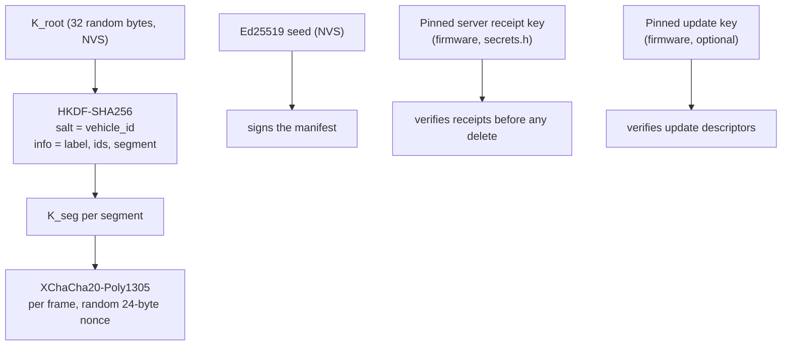

## Engine profiles

Engine- and vehicle-specific behaviour lives in one YAML file per engine under `engines/`, not in the code: which OBD PIDs to ask for, how to turn each reply into the value the capture record stores, the cadence, what supply voltage means "engine running", and the standby and drive-confirmation dwells. A build carries all engines or only the ones you choose, without forking the firmware.

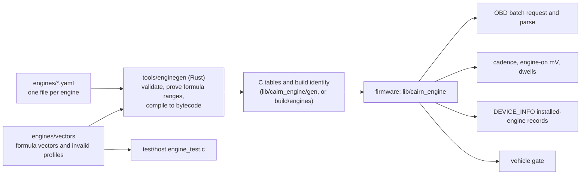

What is in the repository:

| Path | What it is |
|---|---|
| `engines/bmw-n20.yaml` | BMW N20/N26 (F32 428i), status `derived`: every number and formula was extracted from what the firmware hard-coded before, and `engine_test.c` proves each one equal, exhaustively over every possible input byte |
| `engines/bmw-b58.yaml` | BMW B58 (M240i), status `stub`: identity only; the generator rejects a stub that states anything |
| `engines/engine.schema.draft.json`, `engines/SPEC.draft.md` | The schema (`cairn.engine/v1-draft`) and the specification of profiles, the formula language and the bytecode |
| `engines/vectors/expr.draft.txt` | Formula vectors: expressions with inputs, expected values and exact bytecode, expressions the compiler must reject, and raw bytecode with the value or error an evaluator must produce |
| `engines/vectors/invalid/*.yaml` | Profiles that must be rejected, each stating the error it must produce |
| `tools/enginegen/` | The generator (`validate`, `gen`, `list`, `identity`, `vectors`, `eval`) and its tests |
| `lib/cairn_engine/` | The runtime: profile selection, the integer-only formula evaluator, batch request building and reply parsing, the vehicle gate, and the committed all-engines header in `gen/` |

Rules worth knowing:

- **`unknown` is an answer; a missing key is an error.** A value nobody has established is written `unknown`, and the firmware then uses its own device default (the values in `include/config.h`) and can say which values came from the profile. It never borrows another engine's number.
- **Formulas cannot misbehave.** The language is integer-only with no state, loops or calls, every operation must stay inside int32 (nothing wraps), and the generator proves from interval analysis that an accepted formula cannot divide by zero, shift out of range, overflow, or produce a value outside its declared range. The evaluator still checks at run time, because bytecode in flash is only as trustworthy as the flash. A formula yields the value exactly as the capture record stores it, including saturation.
- **Hot and cold PIDs.** Up to six `hot` PIDs share one multi-PID Mode 01 request every cycle; `cold` PIDs are asked one at a time, one slot per cycle.
- **Vehicle gate.** A build can declare the engine it is for (`-DCAIRN_VEHICLE_ENGINE_ID`). If the vehicle is declared or positively identified as needing an engine this build does not carry, or the active profile has no PID table, the firmware refuses to open an OBD session and says so, rather than record data with the wrong table.
- **Identity.** Each profile has a hash (SHA-256 of the file, CRLF read as LF) and each build an identity over its selected engines; the firmware logs both at boot and reports them in `DEVICE_INFO`. The hash is provisional until the engine contract defines canonical bytes.
- **Draft.** `contracts/engine/v1` is unreleased; the schema, specification and vectors live beside the profiles and are meant to move into the contract. Treat nothing here as a stable interface.

Build with a selection (the generator validates first, so an unknown or invalid engine stops before PlatformIO starts); a plain `pio run -e cairn` uses the committed all-engines tables:

```sh
make firmware ENGINES=all                       # every engine in engines/
make firmware ENGINES=bmw-n20                   # or only the ones named, comma separated
make firmware ENGINES=bmw-n20,bmw-b58 ENV=cairn-selftest
make engines-gen                                # regenerate the committed header after editing engines/
make engines-check                              # what CI runs: validate, vectors, header up to date, tests
```

The PID support and formula research for the BMW N20 is in `research/research_notes/BMW N20 OBD PID support/`. Two optional discovery builds find out what a given car answers: `cairn-pidtest` (the support bitmaps and the raw reply beside the converted value for each PID) and `cairn-mtprobe` / `cairn-mtprobe-sniff` (the manual-transmission probe, see `docs/manual-transmission-probe.md`).

## Device info and boot timing

**Device information** (`lib/cairn_devinfo`, `src/device_info.cpp`; [docs/device-info.md](docs/device-info.md)). Characteristic `0040` is a read-only, bonded-link-only, versioned list of records the phone uses to show what it is talking to: firmware version and build, secure-boot and flash-encryption state, device id and fingerprint, enrolment state, storage free and pending bundles, transports present, every installed engine (id, version, hash prefix) and the boot timing. The encoder and decoder match every vector in the contract (including a newer minor version with an unknown record, the 512-byte cut and the malformed values, which are refused). It reports only what it knows: LTE is not claimed, `enrol_state` cannot tell "enrolled with no vehicle" from "not enrolled", and the build time is the compiler's clock read as UTC. A long read of up to 512 bytes over a 185-byte MTU has not been checked on a real phone.

**Boot timing** (`lib/cairn_boottime`, `src/boot_timing.cpp`; [docs/boot-timing.md](docs/boot-timing.md)). Boot speed and time to upload are owner priorities, so the firmware records a monotonic timestamp at each boot stage and prints the deltas once capture and BLE are both up.

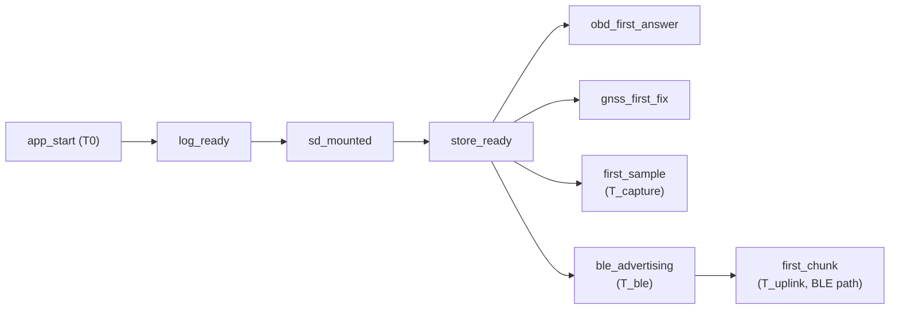

The first mark of a stage wins, so BLE re-advertising after a drive does not overwrite the boot value. A budget check (`cairn_boottime_check`) exists so a regression could be seen without hardware, but no budget is committed because **no boot has been measured on the unit yet**. Safety is not traded for speed: the counter commit, torn-tail recovery and the receipt gate stay.

## Host-tested cores that are not wired in yet

These modules are built, tested on the host and documented, but nothing in `src/` calls them. They exist so the logic is settled and attacked before a radio or a credential is involved. Where a contract is unreleased the module says **provisional**, and what is isolated (the envelope, the wire bytes) is the part expected to change.

### Check-in: signed instructions and the home trigger

`lib/cairn_checkin` implements `contracts/ble/v1/checkin.md` (draft, contracts-v0.2.0; [docs/check-in.md](docs/check-in.md)). When the dongle is back on BLE after a Wi-Fi slot the phone may deliver a small closed set of instructions: `UPLOAD_NOW`, `STOP_TRYING` (1 to 168 hours), `CLEAR_STOP` and `CONFIG`, each signed by the **server** with an instruction key pinned in firmware. The phone only carries them and cannot forge, alter or replay one. An unsigned 6-byte `HOME_TRIGGER` ("you may use Wi-Fi now") is accepted separately, for at most 900 s, never during a trip, and held in RAM only.

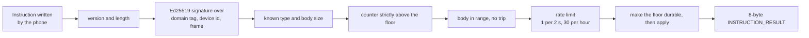

Why it is not wired: it needs the pinned instruction public key (a build-time trust anchor like the receipt key, which `secrets.h` does not have yet), and a remote-control surface should not go live untested on a car, so the characteristics are not created and the capability bits stay clear. The doc lists where it deliberately differs from the contract (persist before the effect, an extra `STORE_FAILED` status) so those can be raised with the contract.

### Configuration receiver

`lib/cairn_config` is what the dongle does with a sealed configuration message from the web UI or iOS app, delivered through a `CONFIG` instruction or an authenticated uplink session ([docs/config-receiver.md](docs/config-receiver.md)). **Provisional:** the config contract is unreleased, so the envelope uses only primitives the enrolment contract already has.

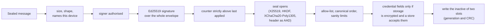

A rejected message does not consume the counter; attempts are rate limited (10 per minute); a rolled-back message cannot be replayed because rollback keeps the counter. Credentials (APN, SIM PIN, Wi-Fi networks, including the home-network list) are refused today, as a whole message, because storage is not encrypted. The doc lists the open points the contract must settle (how the server learns the device's configuration public key, who may sign, and the 440-byte instruction body leaving only about 240 bytes of payload).

### Uplink manager

`lib/cairn_uplink` is the policy that decides which path moves a bundle and when the radio may leave BLE ([docs/uplink-manager.md](docs/uplink-manager.md)). It is portable C with the clock and every outside fact passed in. BLE is the home state; the one radio is time-sliced, never shared.

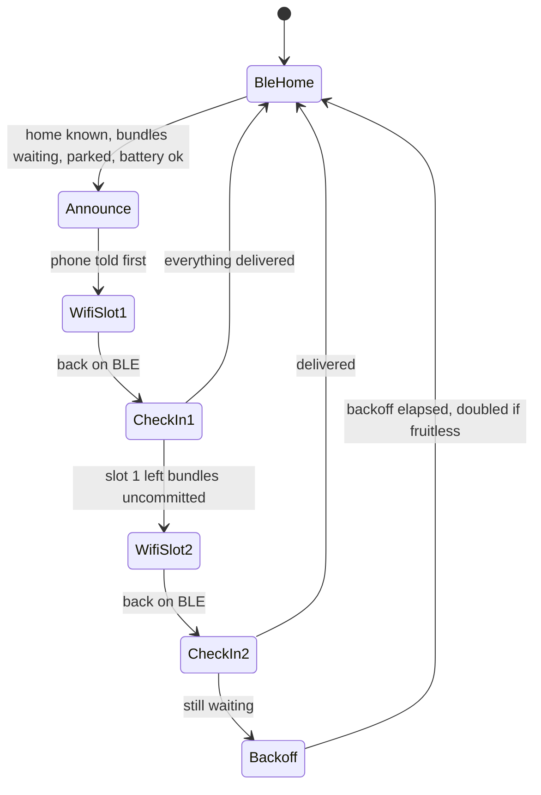

BLE and Wi-Fi are never up together; a connected phone is told before the radio leaves BLE; a trip start, low battery or the slot limit aborts a slot and a stuck caller is forced off; and a delivery ends in a prune only through the receipt gate, so a refused receipt deletes nothing and the next path is tried. A second path resumes from the chunks the server already holds. Home is either phone-asserted (the dongle stores no location) or, with no phone, a bounded, rate-limited scan that runs only when parked with bundles waiting. LTE for whole bundles only if the user allowed it. The slot lengths and backoffs are placeholders to be set from measurement. Not wired because there is no transport to schedule.

### LTE digest and data accounting

Both are **provisional** (the digest and config contracts are unreleased; no contract vectors exist) and secret-free.

- `lib/cairn_digest`: a streaming trip reducer with a hard byte budget. It keeps at most K route points (dropping the interior point whose removal changes the path least), accumulates summary statistics, and encodes within a budget clamped to a compiled-in ceiling, reducing the route and then the event list rather than exceed it. The plaintext digest contains locations, so it never goes to flash or the card; sealing it is a hook with no default, so an unsealed digest is not shippable. A digest acknowledgement can never authorise a prune: that rule has its own test against the real prune gate.
- `lib/cairn_usage`: byte counts per path (LTE, Wi-Fi, BLE) per day and billing period, and the single gate that decides whether LTE traffic may start or continue, with a reason for every refusal. Caps (monthly, daily, per trip) are clamped by compiled-in ceilings; only an authorised signed message can raise a runtime ceiling, and nothing past the absolute maximum. LTE is off until someone turns it on, with digests only by default and roaming off. A persisted attempt limit, per-trip backoff and a circuit breaker survive a reboot loop. Counts err toward over-counting, so a power cut can make the dongle stop early, never run past a cap.

## Tests

The principle: compiling for the ESP32 proves nothing about crash and adversarial behaviour, so the same C sources the device runs are compiled natively and attacked.

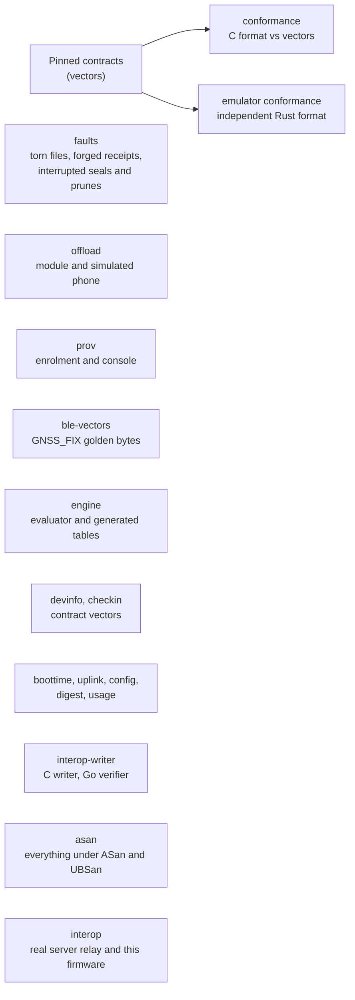

| Suite | What it proves |
|---|---|
| `conformance` | `lib/cairn_format` agrees byte for byte with the Go reference on the pinned format v3 vectors, positive and negative, each checked structurally (no key) and keyed. Ed25519 signing is checked by reproducing the committed signature (it is deterministic). The primitives are first checked against their own published known answers |
| `faults` | The storage property matrix over a POSIX filesystem: torn segments mid-frame and mid-header, flipped bytes, forged and wrong-bundle receipts, interrupted seals and prunes, counter rules, OTA preconditions, update descriptors, pre-roll. Rows assert what is on disk, not what a log said, and are reproducible from a printed seed |
| `ble-vectors` | The phone-GNSS wire layout against the golden vectors from an independent implementation |
| `prov` | X25519 against RFC 7748, the enrolment blob against the Go reference, window, trip and idle rules, atomic commit, the canary no-leak check, legacy slot erasure |
| `offload` | The offload module over real sealed bundles: framing, refusals, MTU, stalls, and the receipt gate under attack (forged receipt, genuine receipt for the wrong bundle, no overwrite of a stored receipt) |
| `mtprobe` | Reply parsing for the manual-transmission probe |
| `engine` | The formula evaluator against `engines/vectors`, the generated N20 tables against the previously hard-coded values (every input byte), and the vehicle gate; run against the committed all-engines tables and, in `make engines-check`, against each selection a build can produce |
| `devinfo`, `checkin` | `DEVICE_INFO`, `UPLINK_EVENT`, instructions and the home trigger against the contract's vectors (`ble/v1/vectors/device-info`, from contracts-v0.2.0). The rows are skipped, with a message, on a contracts pin that lacks them |
| `boottime`, `uplink`, `config` | The boot record and budget check, the uplink schedule and its safety rules, and the configuration receiver, over synthetic inputs (their contracts are unreleased) |
| `digest`, `usage` | The digest reducer and byte budget, the rule that a digest acknowledgement is not a receipt (against the real prune gate), data accounting, caps, power-cut persistence and the retry breaker. Provisional: synthetic data, no contract vectors |
| `interop-writer` | Seals bundles with the C store and format code and leaves them for the server's Go verifier to judge |
| `mutate` | Applies deliberate breakages of the digest and usage safety rules to a copy of the sources and requires the suite to fail on each (`make -C test/host mutate`) |
| `asan` | All of the above under AddressSanitizer and UBSan, since undefined behaviour in the scan path would be a parser reading past a torn segment |

**Rust emulator** (`emulator/`). A second, independent implementation of the format (frames, AEAD, CBOR, manifest, receipts, update descriptors) with two commands: `conformance` runs it against the same pinned vectors, and `fault-matrix` runs a property matrix of local durability rows (no server needed) plus protocol rows against a live server, either the legacy device listener (`--server`) or, as the phone would, the server's relay (`--relay`, with an invitation code the first time). It no longer simulates drives. Two independent implementations agreeing on committed bytes means neither can quietly drag the other along.

**Interop.** `offload-sim` is the real offload module on a pipe, standing in for the dongle in the server repository's Go test. The server's CI runs the full interop script against a firmware commit it pins (required there). Here, `.github/workflows/interop.yml` runs it the other way round every Monday (and on demand): this firmware against the server's current `main`. It is a diagnostic, not a gate: red means look, not revert. It runs three things. `scripts/interop-writer.sh` has the server's `cairn-verify` judge the bundles the C writer produces, then applies deliberate mutations to a copy of the C sources and requires the verifier to reject what the mutated writer seals (`--mutation-check`), so a wrong CRC or frame layout cannot pass unseen. `scripts/relay-interop.sh` builds the server from a checkout into a temporary directory, enrols the emulator as a phone and runs the emulator's protocol rows over the real `/v1/relay/bundles/*` path, including rows only the relay has (reordering, early commit, forged receipts and offers, caller forgery and replay), and `--selftest` proves the run can fail. Finally the server's own interop script runs against this checkout. Neither script modifies the server checkout.

**CI** (`.github/workflows/ci.yml`) runs on the self-hosted `cairn` runner, never a hosted one, and only for pushes and for pull requests from this repository (a fork's pull request never reaches it; `tests/check-runners.sh` enforces this). Jobs: runner policy; the host suites with ASan and UBSan; three target builds (production, self-test, and one with an update key pinned so the OTA path compiles); `engines` (`make engines-check`: validate every profile, check the formula vectors and the invalid-profile vectors, require the committed all-engines header to equal a regeneration, run the generator's tests, and run the firmware's engine tests against one-engine and all-engines selections); and the emulator's tests, conformance and local durability rows.

## Repository layout

| Path | What it is |
|---|---|
| `src/`, `include/` | The application: boot, lifecycle controller, sensing, BLE companion and offload shim, device info, boot timing, USB provisioning, standby. `include/config.h` holds policy constants, `board_config.h` pins and layout, `secrets.h.example` the template |
| `lib/cairn_format/` | Format v3: frames, AEAD, CBOR, hashes, HKDF, Ed25519, manifest and update descriptors |
| `lib/cairn_store/` | Append, rotation, seal, boot recovery, receipt storage and the prune gate |
| `lib/cairn_offload/` | The BLE offload protocol, transport-independent |
| `lib/cairn_prov/` | Enrolment blob, console protocol, legacy credential erasure |
| `lib/cairn_ota/` | OTA preconditions and version ordering |
| `lib/cairn_power/` | Standby decisions, parked-silence and drive-confirmation rules |
| `lib/cairn_fs/`, `lib/cairn_log/` | SD, NVS and POSIX shims; logging to UART and the card |
| `lib/cairn_engine/` | Engine-profile runtime: selection, formula evaluator, batch request and parse, vehicle gate; `gen/` holds the committed all-engines tables |
| `lib/cairn_devinfo/`, `lib/cairn_boottime/` | `DEVICE_INFO` and `UPLINK_EVENT` encoding; the boot-timing record (both wired in) |
| `lib/cairn_checkin/`, `lib/cairn_config/` | Signed instructions and home trigger; sealed configuration receiver (host-tested, not wired in) |
| `lib/cairn_uplink/`, `lib/cairn_digest/`, `lib/cairn_usage/` | Uplink schedule; LTE digest reducer; data accounting and caps (host-tested, not wired in) |
| `engines/` | Engine profiles (YAML), the draft schema and spec, formula and invalid-profile vectors |
| `tools/enginegen/` | Rust generator that validates profiles and emits the C tables |
| `Makefile` | Top-level entry points for engine selection and checks (`firmware`, `engines-gen`, `engines-check`, `engines-test`, `host-test`) |
| `test/host/` | Host test runners, vector glue, `Makefile`, `engine.mk`, `lte.mk` and `mutate.sh` |
| `emulator/` | Rust implementation of the format, conformance and fault matrix |
| `third_party/freematics-base/` | Vendored Freematics hardware drivers (third-party code) |
| `partitions-ab.csv` | A/B partition table |
| `docs/` | Hardware, flashing, OTA, hardening and per-module notes (see the [index](#docs-index)) |
| `research/` | Measurement notes and reports behind design choices (BMW N20 PID support; parked drain on a BMW F32) |
| `scripts/fetch-contracts.sh`, `contracts.lock` | Fetches the pinned protocol contracts |
| `scripts/interop-writer.sh`, `scripts/relay-interop.sh` | Interop against a server checkout: the C writer judged by the Go verifier, and the emulator as the phone over the relay |
| `tests/` | Checks that CI jobs stay on the self-hosted runner |
| `MIGRATION.md` | Where this repository came from |

**Contracts.** The format, enrolment and BLE protocols are specified, with vectors, in [Cairn Vehicle Data Protocols](https://github.com/ParkWardRR/cairn-driving-log-selfhosted/tree/main/contracts). `contracts.lock` pins a release by tag and commit (currently `contracts-v0.2.0`, with format v3, enrolment v1 and BLE v1); both are verified, so a moved tag cannot change what this builds against. `CAIRN_CONTRACTS=<dir>` overrides it for changing a contract and the firmware together; `scripts/fetch-contracts.sh --release` refuses the override and a dirty tree.

## Build, flash and test

You need PlatformIO for the device build, a C compiler and make for the host tests, and Rust (cargo) for the emulator.

```sh
# 1. Protocol contracts (needed by the host tests and the emulator)
scripts/fetch-contracts.sh

# 2. Host tests: every suite (conformance, faults, ble-vectors, mtprobe, prov, offload, engine,
#    boottime, uplink, config, devinfo, checkin, interop-writer, digest, usage)
make -C test/host                 # or: make host-test
make -C test/host asan            # the same under AddressSanitizer and UBSan
make -C test/host conformance     # or any one suite by name, e.g. faults, offload, engine, uplink
make -C test/host offload-sim     # build the dongle-on-a-pipe used by the server's interop test
make -C test/host mutate          # prove the digest and usage safety rows catch deliberate breakage
CAIRN_TEST_VERBOSE=1 make -C test/host faults   # show the firmware's own log lines

# 2b. Engine profiles: validate, vectors, committed header up to date, generator and engine tests
make engines-check

# 3. Emulator
(cd emulator && cargo test)
(cd emulator && cargo run --release -- conformance)
(cd emulator && cargo run --release -- fault-matrix --work-dir target/fault-matrix --verbose)

# 4. Device build
cp include/secrets.h.example include/secrets.h     # then fill in
pio run -e cairn -j 1                              # one job: the build host is memory-constrained
make firmware ENGINES=bmw-n20                      # or: choose which engine profiles are compiled in
```

Environments in `platformio.ini`:

| Environment | Use |
|---|---|
| `cairn` | Production capture image (BLE in every build) |
| `cairn-selftest` | Bench image: runs known-answer checks, writes and seals a synthetic bundle, reports `[PASS]` lines, then **halts instead of capturing** |
| `cairn-ble` | Alias of `cairn`, kept from when BLE was optional |
| `cairn-pidtest` | Capture plus raw and converted values for every PID, every 5 s |
| `cairn-mtprobe`, `cairn-mtprobe-sniff` | Manual-transmission discovery; the sniff variant also takes the OBD link out of request mode briefly, so run the plain probe first |

Flash the self-test image first, read it, then the capture image:

```sh
pio run -e cairn-selftest -t upload --upload-port /dev/cu.usbserial-<n>     # macOS; /dev/ttyUSB0 on Linux
pio device monitor -b 115200 --filter esp32_exception_decoder
pio run -e cairn -t upload --upload-port /dev/cu.usbserial-<n>
```

Use 460800 when calling `esptool` directly: 921600 fails on this USB-serial adapter with "unable to verify flash chip connection", which looks like wiring but is the baud rate. Expect the self-test to print passes for CRC-32, SHA-256, Ed25519, framed appends, seal, and `N sealed bundle(s) awaiting hand-off`, then `self-test PASSED`. The bench steps, the round-trip procedure and what each line means are in [docs/v2-firmware-testing.md](docs/v2-firmware-testing.md), [docs/flashing-and-testing.md](docs/flashing-and-testing.md) and [docs/hardware-roundtrip.md](docs/hardware-roundtrip.md); expect some Wi-Fi-era wording in the first two (see the docs index).

**Never burn eFuses on the only unit in the car.** Nothing in the builds above does.

## Configuration

| Where | What |
|---|---|
| `include/secrets.h` | Keys and passkey, see [secrets.h](#secretsh) |
| `include/config.h` | Capture policy (sampling periods, trip thresholds with dwell, pre-roll), power constants (standby idle 5 min, heartbeat 6 h, engine-on 13.2 V), stack sizes, BLE name, hand-off timers. Changing a threshold means bumping `CAIRN_POLICY_VERSION`, which is recorded in every bundle |
| `include/board_config.h` | SD chip select and LED pins, mount retry counts, directory layout, log budgets |
| `platformio.ini` | Environments and flags (`-O2`, `-DCAIRN_USE_ESP_ROM_CRC`, BLE on, one NimBLE bond); NimBLE is the only library dependency |
| `engines/*.yaml` | Engine profiles; which are compiled in is chosen with `make firmware ENGINES=...` (see [Engine profiles](#engine-profiles)) |
| `contracts.lock` | Contract pin |

To turn the OTA gate on, define `CAIRN_UPDATE_KEY_HEX` in `secrets.h` or via `PLATFORMIO_BUILD_FLAGS`, as the CI "Build with OTA enabled" step does.

## Troubleshooting

| Symptom | Likely cause and what to do |
|---|---|
| LED stays lit, nothing captured | The card did not mount. Reseat it; the firmware retries every 15 s and starts capturing as soon as a mount succeeds. A marginal contact is a known issue on this unit |
| Log says `NOT ASSIGNED` | No assignment is installed. Capture works but the server refuses the bundles. Provision over USB |
| `refused: no PROV-READY` | The 60 s provisioning window after boot has closed on an assigned device, or a trip is open. Reset and begin again |
| Offload answers `TRIP_ACTIVE` | A trip is open, including the dwell before sealing. Try again a few minutes after parking |
| Every offload request answers `IO_ERROR` | MTU below the minimum payload. Negotiate the MTU before the first request |
| Offload outcome 2 or 3 | The server's receipt key and the key pinned in this firmware disagree (2), or the receipt names other content (3). Do not retry; fix the key and reflash |
| Offload outcome 4, or the card never frees | No receipt key pinned (all-zero placeholder). Bundles are safe; flash a build with the real key |
| Server `assignment_refused` | The assignment id on the card is not one the server issued. Reprovision |
| Server `key_missing` | The root was never escrowed, or NVS was erased and a new root generated. Re-enrol with a new key version, never overwrite |
| Server `quarantined` | A counter was reused with different content: a cloned unit, a restored card image or rolled-back NVS. Investigate first |
| Server cannot decode (`AUTH_FAILED`) | The server holds a different root than the device uses |
| Log: format self-check failed, capture refused | This build's CRC-32 or SHA-256 does not match the specification, so it would write data the verifier rejects. Reflash a correct build |
| Log: "refusing OBD" naming an engine | The build does not carry the engine the vehicle needs, or the active profile (for example the B58 stub) has no PID table, so nothing is requested from the ECU. Build with the right profile selected |
| Log: "boot partition is X but Y is running" | The last update was rolled back |
| Log: `sensor facts dropped` | The controller could not drain the sensing queue; the count is also in `DEVICE_HEALTH` |
| Log: stack headroom warning | The boot log reports free stack after a seal; raise `CAIRN_LOOP_STACK_BYTES` if it nears the canary |
| Scripted serial capture hangs at `entry 0x400805e4` | Hold one file descriptor open across the capture and do not use `--after hard-reset`; see `docs/v2-firmware-testing.md` |

Logs are on the card in `/cairn/logs/boot-<count>-<n>.log`; grep `[LIFE]` for every transition and why, `[STORE]` for recovery, and `[OFFLOAD]` and `[PRUNE]` for receipts. A bundle can be checked with no server using `cairn-verify` from the server repository.

## FAQ

**Why can't I just see my trips on the dongle?** It has no screen and no network, and the card holds ciphertext by design. Trips appear in the web dashboard after the phone offloads them.

**What if the phone never offloads?** Bundles stay on the card. Nothing is deleted without a receipt, so the card simply fills; the dongle never trades a trip for space.

**Can the phone lose or read my data?** It can fail to upload; it cannot read a trip (it holds no key), forge a receipt, or make the dongle delete anything the server did not acknowledge for exactly those bytes.

**Is this the same as passkey login?** No. The six-digit `CAIRN_BLE_PASSKEY` is the Bluetooth pairing code. Server and web sign-in are separate; the intent there is that both passkeys and Tailnet identity are supported, which is tracked in [cairn-vehicle-server](https://github.com/ParkWardRR/cairn-vehicle-server) and [cairn-vehicle-web-dashboard](https://github.com/ParkWardRR/cairn-vehicle-web-dashboard).

**Will the dongle get Wi-Fi and LTE?** Yes: the owner has decided it will (see "Direction changes since the split" in the front door's [ROADMAP](https://github.com/ParkWardRR/cairn-driving-log-selfhosted/blob/main/ROADMAP.md)), with flash and NVS encryption to land before any network credential is stored. Today the firmware has no Wi-Fi or LTE transport and no credential store; what exists is the host-tested logic around them (uplink schedule, configuration receiver, check-in, digest, data caps), which is not called from the firmware yet.

**How much PSRAM is there?** The chip is 8 MB; the bench notes measured about 4 MB usable on this revision v1.0 silicon, and a first-boot table in the same file says 8 MB. The firmware builds with PSRAM enabled and does not depend on the figure.

**Why Arduino on ESP-IDF rather than a plain IDF app, or Zephyr?** `framework = arduino` on espressif32 7.x is an ESP-IDF 5.x component bundle, so every IDF API needed is available and the vendored Freematics drivers keep working. The catch is that secure boot and flash encryption are compile-time options the prebuilt Arduino libraries do not let you toggle, so the hardening plan includes moving to the Arduino-as-component form. An RTOS switch was evaluated and rejected (`docs/rtos-evaluation.md`).

**Why is CRC-32 the IEEE one?** So the ESP32 ROM routine can compute it. The host conformance run proves the ROM convention matches the portable fallback.

**Does it work in other cars?** The capture path is generic OBD-II Mode 01, but the only profile with real content is the BMW N20 (derived from the firmware's earlier hard-coded behaviour), and the measurements and the parked-silence reasoning were done on a BMW 428i. To support another engine, add a profile under `engines/` (a `stub` is accepted for identity only) and build with it selected; a profile marked `verified` is one checked against raw ECU replies from the real car, and none is yet.

## Docs index

| File | What it covers |
|---|---|
| [docs/boot-timing.md](docs/boot-timing.md) | The boot-timing record: stage definitions, what is instrumented, what is not yet measured, and how to measure on hardware |
| [docs/check-in.md](docs/check-in.md) | Signed check-in instructions and the home trigger (`lib/cairn_checkin`): what is enforced, where it differs from the contract, why it is not wired |
| [docs/config-receiver.md](docs/config-receiver.md) | The sealed configuration receiver (`lib/cairn_config`): the check order, status, and the open points for the config contract |
| [docs/device-info.md](docs/device-info.md) | `DEVICE_INFO` and `UPLINK_EVENT` over BLE: what is reported, the limits of each record, what is not verified |
| [docs/esp32-hardening.md](docs/esp32-hardening.md) | Flash encryption, secure boot, the key hierarchy, irreversibility table, and the chip-revision finding |
| [docs/flashing-and-testing.md](docs/flashing-and-testing.md) | Measured hardware profile (chip, flash, IMU, GNSS, pins, ADC), bugs found in the vendored drivers, flashing and bring-up record. Parts predate the removal of Wi-Fi |
| [docs/freematics-emulation-spec.md](docs/freematics-emulation-spec.md) | Reference description of the real device and sensor behaviour (no longer a simulator spec) |
| [docs/hardware-roundtrip.md](docs/hardware-roundtrip.md) | The capture, seal, offload, receipt and prune round trip on real hardware, with failure meanings |
| [docs/manual-transmission-probe.md](docs/manual-transmission-probe.md) | The discovery builds that ask the ECU for gear, clutch and torque candidates |
| [docs/ota.md](docs/ota.md) | The signed-update design: descriptor, preconditions, ordering, rollback, signing. Its HTTP serving section is retired |
| [docs/rtos-evaluation.md](docs/rtos-evaluation.md) | Research: Zephyr and NuttX against Arduino on ESP-IDF; conclusion: not viable today |
| [docs/uplink-manager.md](docs/uplink-manager.md) | The uplink schedule (BLE home, Wi-Fi slots, check-ins, backoff), home detection and the LTE trigger; host-tested, not wired |
| [docs/v2-firmware-testing.md](docs/v2-firmware-testing.md) | Flashing, reading the self-test and the SD logs, the card layout, deliberate-breakage bench tests, standby. Contains Wi-Fi and mTLS sections that no longer apply |
| [docs/v2-hardware-mapping-audit.md](docs/v2-hardware-mapping-audit.md) | The firmware's pin and bus assumptions checked against the vendor guide, the driver library and measurements |
| [engines/SPEC.draft.md](engines/SPEC.draft.md) | Draft specification of engine profiles, the integer formula language, the bytecode and the vectors (not in `docs/`; lives beside the profiles) |
| [research/](research/) | BMW N20 PID support and formulas; Freematics parked-drain notes and report |
| [MIGRATION.md](MIGRATION.md) | How this repository was extracted from the original monorepo |

## Contributing

- Work on a branch of this repository and open a pull request to `main`. CI runs only for branches of this repository, on the self-hosted runner.
- Run `make -C test/host` and `make -C test/host asan` (after `scripts/fetch-contracts.sh`) before pushing, `make engines-check` if you touched `engines/`, `tools/enginegen` or `lib/cairn_engine` (and `make engines-gen` to refresh the committed header), and `pio run -e cairn -j 1` if you touched `src/`, `include/` or `platformio.ini`. Use one build job: the build host is memory-constrained.
- Put anything that decides what is stored or deleted in `lib/` as portable C, and give it a host test that states the property, attacks it and asserts what is on disk. A new failure mode gets a new row.
- Protocol changes are contract-first: change the contracts and their vectors in the front door repository, then bump `contracts.lock`. A firmware-only change to a wire format is a bug.
- Never commit `include/secrets.h`, real keys, hostnames, device ids or card images. Keep placeholders in every tracked file.
- Do not enable eFuse-burning options (flash encryption release mode, secure boot) in any build.
- Keep this README honest: separate shipped, host-tested only and planned.

## License

[Blue Oak Model License 1.0.0](LICENSE). The vendored Freematics drivers under `third_party/freematics-base/` are third-party code under their own licenses (the Freematics sources are marked BSD; the bundled TinyGPS is LGPL 2.1 or later); see the headers in those files. The Ed25519 field arithmetic in `lib/cairn_format/cf_ed25519.c` is adapted from the public-domain TweetNaCl.

## Related repositories

- [cairn-driving-log-selfhosted](https://github.com/ParkWardRR/cairn-driving-log-selfhosted): the front door, system docs, roadmap and the shared contracts
- [cairn-vehicle-server](https://github.com/ParkWardRR/cairn-vehicle-server): the server, relay and tools (`cairn-provision`, `cairn-signfw`, `cairn-verify`)
- [cairn-vehicle-web-dashboard](https://github.com/ParkWardRR/cairn-vehicle-web-dashboard): the web dashboard
- [cairn-ios-companion-app](https://github.com/ParkWardRR/cairn-ios-companion-app): the iPhone app
- [cairn-original-monorepo-archive](https://github.com/ParkWardRR/cairn-original-monorepo-archive): the archived original monorepo
